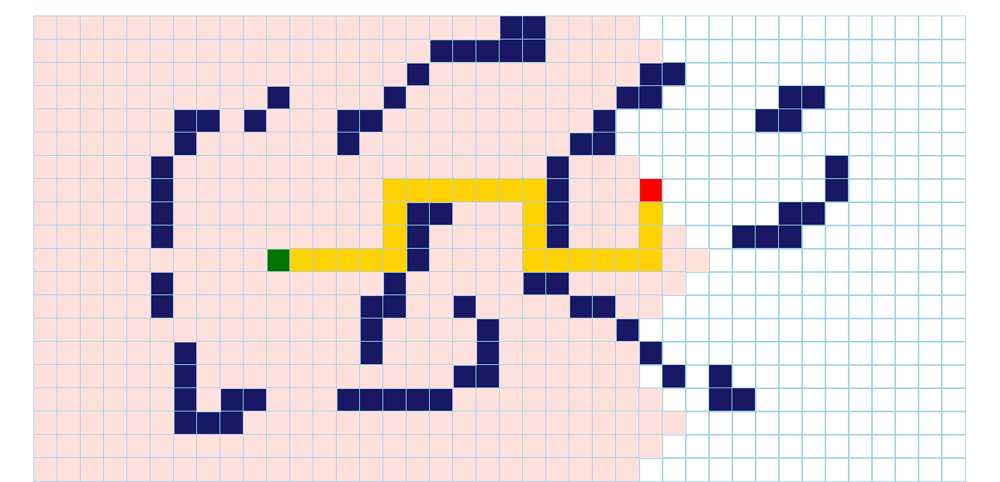
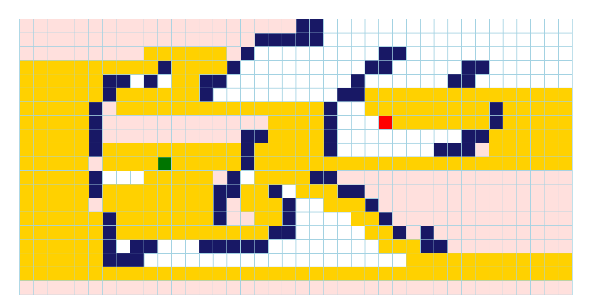
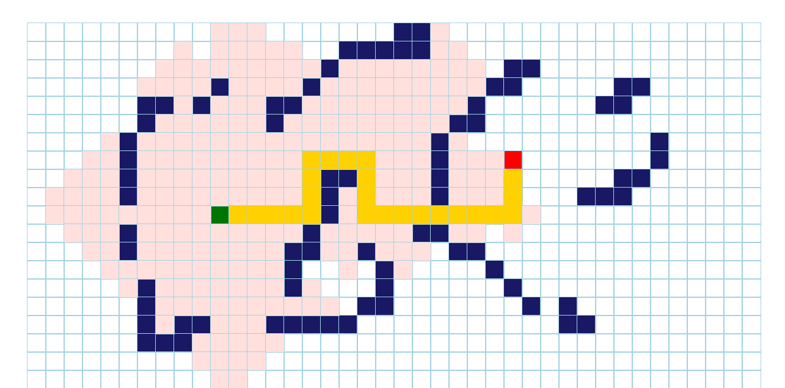

# Pathfinding Visualizer

This project graphically shows how different path finding algorithms search for the finish node.
<br /><br />
Click here for a [Live Demo](https://tvdao.github.io/pathfindingVisualizer/)
<br /><br />


## Overview:

This project visualizes path finding algorithms like BFS, DFS, etc. All the algorithms
start at the green node and it searches for the red node, as shown in the image above. 
The app was all built in React.

## Intro:

I built this project to reinforce my understandings of common path finding algorithms like BFS and DFS. I had trouble imagining how these algorithms ran in my head, and I thought a visual representation of the algorithms would help my comprehension of these algorithms. Through building this project, I also got to learn more path finding algorithms like A*. 

## Meet The Algorithms:

### Breadth First Search 
- Traverses equally in each direction
- Used for unweighted graphs
- Will always find the shortest path
<br /><br />


### Dephth First Search
- Traverses in one direction as far as possible before backtracking
- Used for unweighted graphs
- Will not always find the shortest path
<br /><br />


### Dijkstra
- Traverses graph using the distance from node to node. Picks the smallest distance.
- Used for weighted graphs
- Will always find the shortest path
<br /><br />


### A Star
- Best pathfinding algorithm out of the 4. Variation of Dijkstra's algorithm, using heuristics to guide itself.
- Used for weighted graphs
- Will always find the shortest path
<br /><br />


## Getting started:
First install node.js in order to run javascript in your local system. Type the following commands in the terminal to create a react project.
```
npx create-react-app my-app
cd my-app 
npm start
```

### `npm start`
Runs the app in the development mode. Open [http://localhost:3000](http://localhost:3000) to view it in the browser. The page will reload if you make edits. You will also see any lint errors in the console.

### `npm run build`

Builds the app for production to the `build` folder.\
It correctly bundles React in production mode and optimizes the build for the best performance.

The build is minified and the filenames include the hashes.\
Your app is ready to be deployed!

The app is deployed in github pages.

## Learn More

You can learn more in the [Create React App documentation](https://facebook.github.io/create-react-app/docs/getting-started).

To learn React, check out the [React documentation](https://reactjs.org/).

### Code Splitting

This section has moved here: [https://facebook.github.io/create-react-app/docs/code-splitting](https://facebook.github.io/create-react-app/docs/code-splitting)

### Analyzing the Bundle Size

This section has moved here: [https://facebook.github.io/create-react-app/docs/analyzing-the-bundle-size](https://facebook.github.io/create-react-app/docs/analyzing-the-bundle-size)

### Making a Progressive Web App

This section has moved here: [https://facebook.github.io/create-react-app/docs/making-a-progressive-web-app](https://facebook.github.io/create-react-app/docs/making-a-progressive-web-app)

### Advanced Configuration

This section has moved here: [https://facebook.github.io/create-react-app/docs/advanced-configuration](https://facebook.github.io/create-react-app/docs/advanced-configuration)

### Deployment

This section has moved here: [https://facebook.github.io/create-react-app/docs/deployment](https://facebook.github.io/create-react-app/docs/deployment)

### `npm run build` fails to minify

This section has moved here: [https://facebook.github.io/create-react-app/docs/troubleshooting#npm-run-build-fails-to-minify](https://facebook.github.io/create-react-app/docs/troubleshooting#npm-run-build-fails-to-minify)
